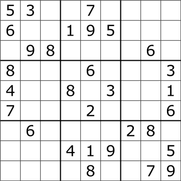
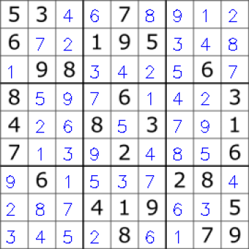

Sudoku solver using computer vision in ~200 lines:

cvision.Puzzle():  
- Scale and convert image to greyscale
- Apply adaptive Gaussian binary thresholding
- Apply Canny edge detection
- Use Hough Lines algorithm to detect lines
- Crop sudoku cells using detected lines
- Use OCR to detect the numbers populating the cells
    - Using Google's Tesseract OCR with the pytesseract bindings.
- Pass sudoku board to the sudoku solver
- Write the solved board back into the input image!

solver.Solver():  
- Solve the sudoku puzzle using backtracking
- https://en.wikipedia.org/wiki/Sudoku_solving_algorithms

If I were to come back to this project:  
- Optimize the OCR
- Better image processing: the test image is pretty uniform in color and lighting,
  so perhaps I could focuse more on smoothing out images with non uniform lighting and
  handling images with sudoku boards oriented at different angles, among other things.
- Maybe construct a mobile app aronud this premise
